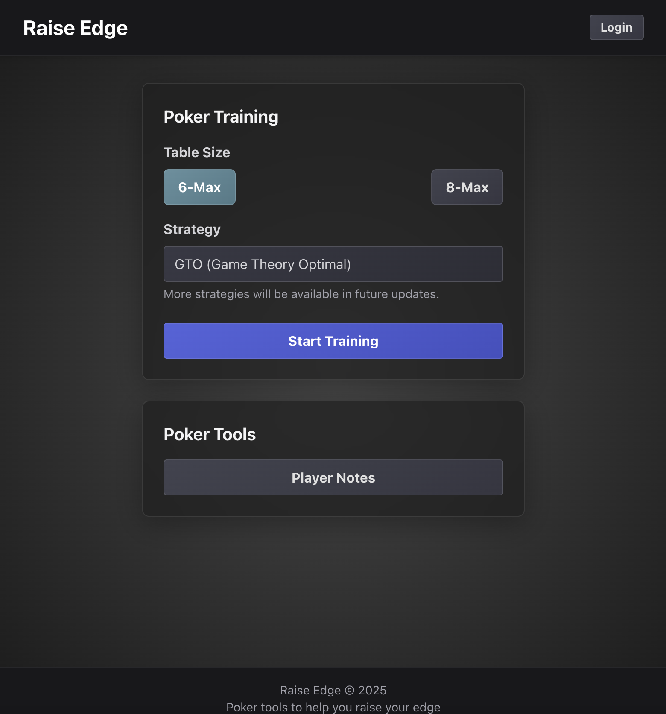
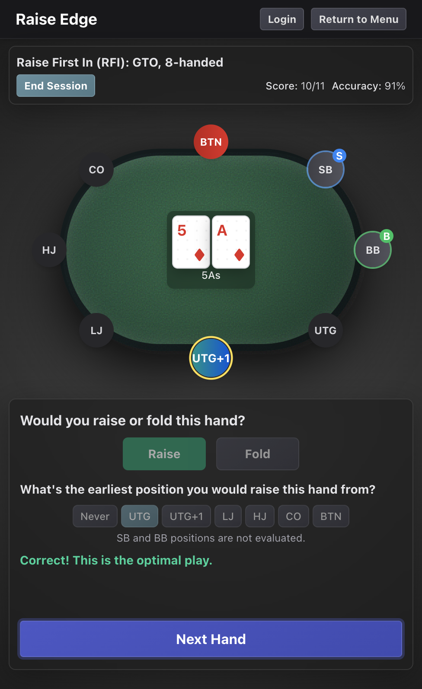
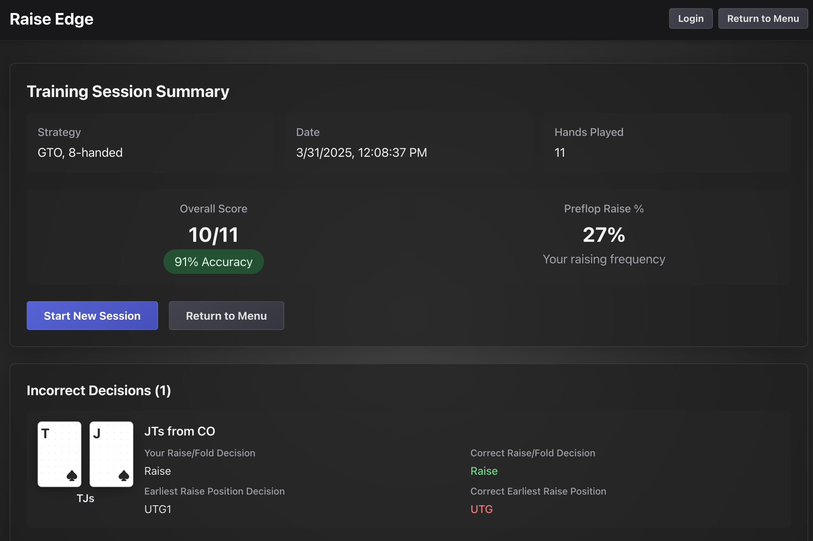
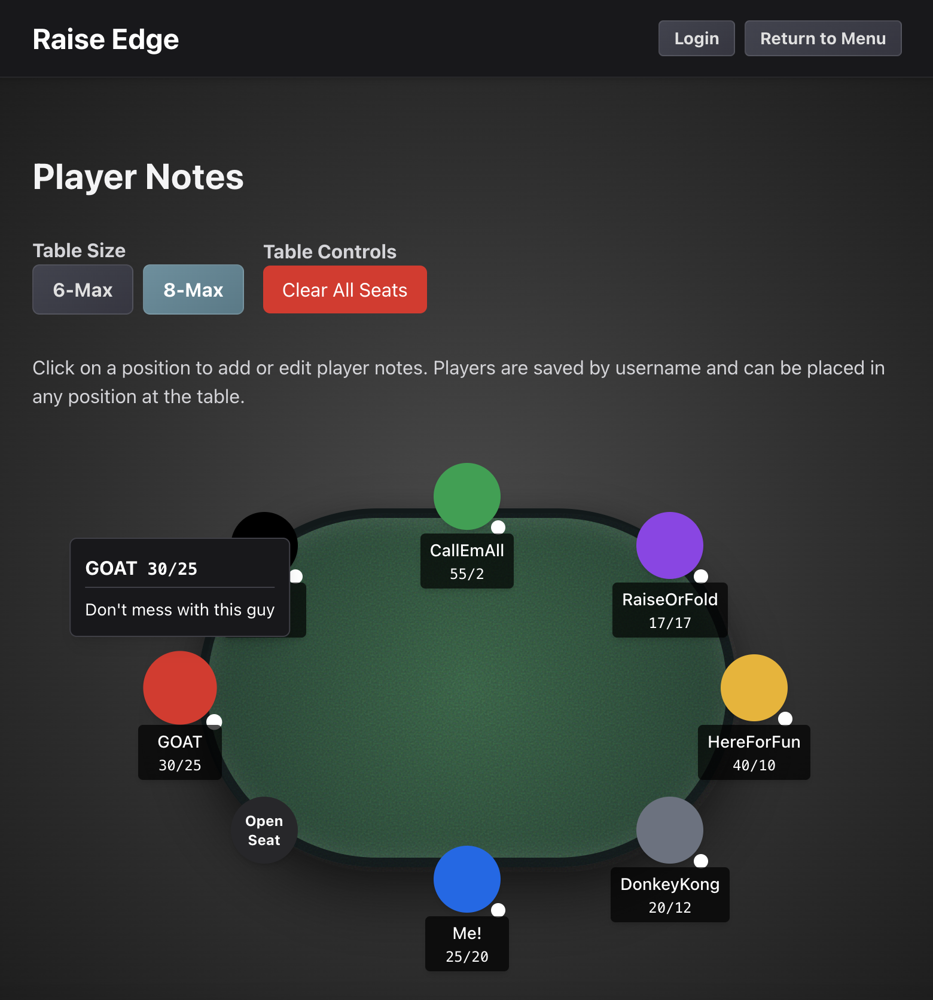

# Raise Edge

A web-based application to help poker players practice their preflop decision-making skills based on GTO (Game Theory Optimal) strategies. This tool helps players learn and internalize optimal preflop ranges for different positions and stack sizes.

This app starts with preflop strategy simply because it happens the most often. Even the best players in the world can (and do) make mistakes preflop. This trainer will help you improve your preflop decision-making. The strategy built into the app is based on GTO, which is applicable to most games, but it's important to deviate from this strategy if the situation warrants it. For example, GTO might recommend opening AT offsuit from the hijack or later, but you may reconsider this if you have very loose players left to act. Similarly, you might open up your range if very tight players are left to act and weaker players are in the blinds. Keep this in mind as you practice this strategy. 

For 6-max, the positions are intentionaly named by working back from the button. What this means is that UTG is called the lojack (LJ) in 6-max games. This design decision was aimed at helping you train for both 6-max and 8-max games and prevent confusion with position names between the two formats. 

## Screenshots

### Start Screen
*The start screen allows you to quickly access the GTO training mode and player notes page.*
<div align="center">
  
</div>


### GTO Training Mode
*Practice your preflop decisions with immediate feedback based on GTO principles.*
<div align="center">
  
</div>


### Statistics Dashboard
*Track your performance and analyze your decision-making patterns.*
<div align="center">
  
</div>


### Player Notes Table
*The player notes table allows you to track and color-code opponents, with quick access to their playing style and statistics.*
<div align="center">
  
</div>


## Features

- **Interactive Preflop Training**
  - Practice preflop strategy with 6-max and 8-max table configurations
  - Real-time feedback on your decisions
  - Position-based training (UTG, MP, CO, BTN, SB, BB)

- **Player Notes System**
  - Save notes about specific players
  - Display VPIP/PFR statistics
  - Color-code players for quick reference
  - Works both locally and with cloud storage (Supabase)

- **Detailed Statistics**
  - View statistics on your preflop decision-making 
  - Analyze hand decisions with detailed feedback

- **Authentication Options**
  - Local-only mode for quick practice
  - Supabase authentication for storing player notes in the cloud 
  - Seamless migration of local notes to cloud storage when you sign up

## Technology Stack

- **Frontend**
  - React with TypeScript
  - Tailwind CSS for styling
  - Vite for build tooling

- **Backend & Storage**
  - Supabase for authentication and cloud storage
  - Local storage fallback for offline use
  - JSON-based strategy database sourced from [Upswing Poker](https://www.upswingpoker.com/)

## Getting Started

### Prerequisites

- Node.js (v16 or higher)
- npm or yarn
- Git

### Local Development Setup

1. Clone the repository
   ```bash
   git clone https://github.com/andyisbuilding/raise-edge.git
   cd raise-edge
   ```

2. Install dependencies
   ```bash
   npm install
   ```

3. Start the development server
   ```bash
   npm run dev
   ```

4. Open your browser and navigate to `http://localhost:5173`

### Setting Up Supabase (Optional)

To enable cloud storage for your notes instead of using local storage:

1. Create a Supabase account at [https://supabase.com](https://supabase.com)

2. Create a new project

3. Create a `.env` or `.env.local` file in the project root with your Supabase credentials:
   ```
   VITE_SUPABASE_URL=your_supabase_project_url
   VITE_SUPABASE_ANON_KEY=your_supabase_anon_key
   ```

Remember to replace `your_supabase_project_url` and `your_supabase_anon_key` with your actual Supabase project details and to never share this information or commit it to version control (GitHub, GitLab, etc.)

4. Set up the database table for player notes:
   ```sql
   create table player_notes (
     id uuid default uuid_generate_v4() primary key,
     user_id uuid references auth.users not null,
     username text not null,
     note text,
     vpip_pfr text,
     color text,
     created_at timestamp with time zone default timezone('utc'::text, now()) not null,
     updated_at timestamp with time zone default timezone('utc'::text, now()) not null,
     unique(user_id, username)
   );
   ```

5. Enable Row Level Security (RLS) policies:
   ```sql
   alter table player_notes enable row level security;

   create policy "Users can only access their own notes"
     on player_notes for all
     using (auth.uid() = user_id);
   ```

### Building for Production

1. Build the project
   ```bash
   npm run build
   ```

2. Preview the production build
   ```bash
   npm run preview
   ```

## Contributing

Contributions are welcome! Please feel free to submit a Pull Request.

1. Fork the repository
2. Create your feature branch (`git checkout -b feature/AmazingFeature`)
3. Commit your changes (`git commit -m 'Add some AmazingFeature'`)
4. Push to the branch (`git push origin feature/AmazingFeature`)
5. Open a Pull Request

## Support

If you find this project helpful, please consider:
- Starring the repository
- Reporting bugs
- Contributing improvements
- Sharing with other poker players

## Roadmap

- [ ] Add more preflop scenarios 
- [ ] Tournament Strategy: Push / fold charts with 10 and 15bb stacks
- [ ] Performance analytics dashboard 

## Contact

Andy - [@andyisbuilding](https://twitter.com/andyisbuilding) 
